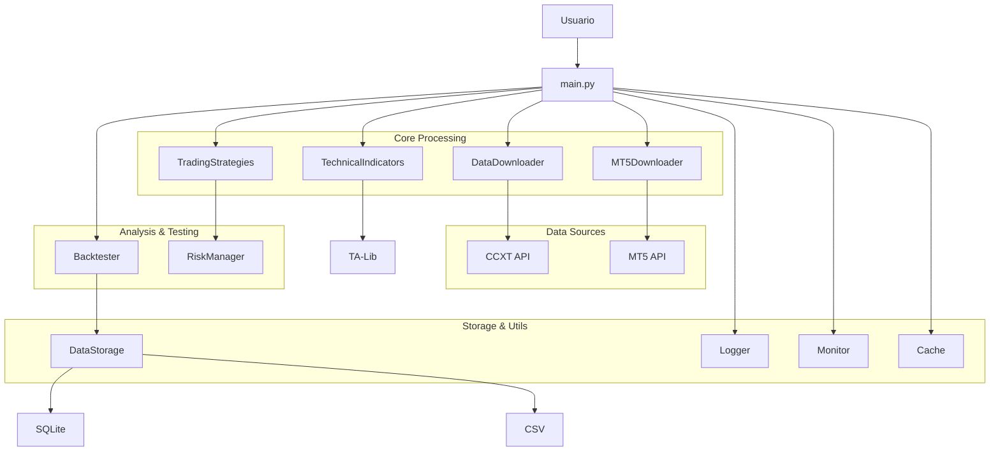
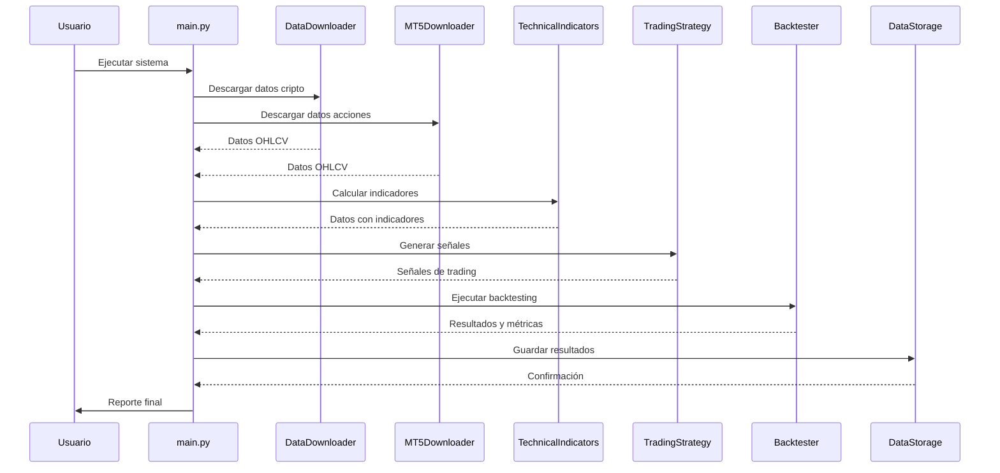

# 🏗️ Arquitectura del Sistema - Bot Trader Copilot v1.0

## 📋 Visión General

El **Bot Trader Copilot** sigue una arquitectura modular y escalable diseñada para procesamiento de datos financieros de alta performance. El sistema combina procesamiento asíncrono, machine learning y análisis técnico profesional.

## 🏛️ Arquitectura General



## 🔧 Componentes Principales

### **1. Data Acquisition Layer (Capa de Adquisición de Datos)**

#### **DataDownloader (CCXT)**
```python
class DataDownloader:
    """
    Responsabilidades:
    - Conexión con exchanges cripto
    - Descarga asíncrona de datos OHLCV
    - Gestión de rate limits
    - Validación de datos
    """
```

**Características:**
- **Async/Await**: Procesamiento concurrente
- **Rate Limiting**: Control automático de límites API
- **Error Handling**: Reintentos con backoff exponencial
- **Data Validation**: Verificación de integridad OHLCV

#### **MT5Downloader**
```python
class MT5Downloader:
    """
    Responsabilidades:
    - Conexión con MetaTrader 5
    - Descarga de datos de acciones
    - Detección automática de formatos
    - Conversión de timeframes
    """
```

**Características:**
- **Symbol Detection**: Formatos múltiples automáticos
- **Timeframe Support**: 1m, 5m, 15m, 1h, 4h, 1d
- **Date Range**: Períodos históricos flexibles
- **Fallback**: A CCXT si MT5 falla

### **2. Processing Layer (Capa de Procesamiento)**

#### **TechnicalIndicators**
```python
class TechnicalIndicators:
    """
    Responsabilidades:
    - Cálculo de indicadores TA-Lib
    - Normalización de datos
    - Feature engineering
    - Validación técnica
    """
```

**Indicadores Implementados:**
- **Trend**: SAR, ADX, EMA
- **Volatility**: ATR, Bollinger Bands
- **Momentum**: RSI, MACD
- **Volume**: OBV, Volume Rate of Change

#### **TradingStrategies**
```python
class TradingStrategy:
    """
    Interfaz base para estrategias:
    - generate_signals(): Genera señales de compra/venta
    - calculate_position_size(): Tamaño de posición
    - validate_signal(): Validación de señales
    """
```

**Estrategias Disponibles:**
1. **UTBotConservative**: Baja frecuencia, alta precisión
2. **UTBotIntermediate**: Balance riesgo/retorno
3. **UTBotAggressive**: Alta frecuencia, mayor riesgo
4. **OptimizedStrategy**: ML-enhanced

### **3. Analysis Layer (Capa de Análisis)**

#### **Backtester**
```python
class AdvancedBacktester:
    """
    Responsabilidades:
    - Simulación histórica de trading
    - Cálculo de métricas profesionales
    - Comparación de estrategias
    - Análisis de riesgo
    """
```

**Métricas Calculadas:**
- **Performance**: Win Rate, Profit/Loss, Sharpe Ratio
- **Risk**: Maximum Drawdown, VaR, Expected Shortfall
- **Efficiency**: Profit Factor, Recovery Factor
- **Timing**: Avg Win/Loss, Payoff Ratio

#### **RiskManager**
```python
class RiskManager:
    """
    Responsabilidades:
    - Monitoreo de posiciones
    - Circuit breaker system
    - Gestión de drawdown
    - Validación de límites
    """
```

**Niveles de Riesgo:**
- **Low**: < 10% drawdown
- **Medium**: 10-25% drawdown
- **High**: 25-50% drawdown
- **Critical**: > 50% drawdown

### **4. Storage Layer (Capa de Almacenamiento)**

#### **DataStorage**
```python
class DataStorage:
    """
    Arquitectura híbrida:
    - SQLite: Consultas complejas
    - CSV: Análisis rápidos
    - Cache: Aceleración de acceso
    """
```

**Características:**
- **Normalization**: Datos escalados para ML
- **Compression**: Archivos comprimidos
- **Backup**: Recuperación automática
- **Indexing**: Consultas optimizadas

### **5. Utilities Layer (Capa de Utilidades)**

#### **Logger**
```python
class Logger:
    """
    Sistema de logging multinivel:
    - DEBUG: Información detallada
    - INFO: Operaciones normales
    - WARNING: Situaciones anómalas
    - ERROR: Errores recuperables
    - CRITICAL: Errores críticos
    """
```

#### **CacheManager**
```python
class CacheManager:
    """
    Cache inteligente con TTL:
    - Memoria y disco
    - Invalidation automática
    - Size limits
    """
```

#### **PerformanceMonitor**
```python
class PerformanceMonitor:
    """
    Monitoreo en tiempo real:
    - CPU/Memory usage
    - API response times
    - Error rates
    - Throughput metrics
    """
```

## 🔄 Flujo de Datos



## 🎯 Patrones de Diseño

### **Strategy Pattern**
```python
# Interfaz común para todas las estrategias
class TradingStrategy(ABC):
    @abstractmethod
    def generate_signals(self, data: pd.DataFrame) -> pd.DataFrame:
        pass

# Implementaciones específicas
class UTBotConservative(TradingStrategy):
    def generate_signals(self, data: pd.DataFrame) -> pd.DataFrame:
        # Lógica específica
        pass
```

### **Observer Pattern**
```python
# Sistema de eventos para logging y monitoreo
class EventManager:
    def __init__(self):
        self._observers = []

    def attach(self, observer):
        self._observers.append(observer)

    def notify(self, event):
        for observer in self._observers:
            observer.update(event)
```

### **Factory Pattern**
```python
# Creación dinámica de componentes
class ComponentFactory:
    @staticmethod
    def create_downloader(source_type: str):
        if source_type == "crypto":
            return DataDownloader()
        elif source_type == "stocks":
            return MT5Downloader()
        else:
            raise ValueError(f"Tipo desconocido: {source_type}")
```

### **Decorator Pattern**
```python
# Logging y monitoreo automático
def with_logging(func):
    @wraps(func)
    def wrapper(*args, **kwargs):
        logger.info(f"Ejecutando {func.__name__}")
        start_time = time.time()
        try:
            result = func(*args, **kwargs)
            logger.info(f"{func.__name__} completado en {time.time() - start_time:.2f}s")
            return result
        except Exception as e:
            logger.error(f"Error en {func.__name__}: {e}")
            raise
    return wrapper
```

## 📊 Escalabilidad y Performance

### **Optimizaciones Implementadas**

#### **Procesamiento Paralelo**
- **AsyncIO**: Descargas simultáneas
- **Multiprocessing**: Cálculos pesados
- **Threading**: Operaciones I/O

#### **Optimización de Memoria**
- **Generators**: Procesamiento lazy
- **Chunking**: Datos en bloques
- **Garbage Collection**: Liberación automática

#### **Caching Estratégico**
- **Multi-level**: Memoria → Disco → Red
- **TTL**: Expiración automática
- **LRU**: Least Recently Used eviction

### **Benchmarks de Performance**

| Operación | Tiempo Promedio | Optimización |
|-----------|----------------|--------------|
| Descarga 1 símbolo | 2-3 segundos | Async + Cache |
| Descarga 10 símbolos | 5-8 segundos | Concurrente |
| Cálculo indicadores | 0.5-1 segundo | Vectorized |
| Backtesting 1000 trades | 1-2 segundos | NumPy optimized |
| Almacenamiento | 0.1-0.5 segundos | Batch writes |

## 🔒 Seguridad y Robustez

### **Validaciones Implementadas**

#### **Data Validation**
```python
def validate_ohlcv_data(df: pd.DataFrame) -> bool:
    """
    Validaciones:
    - Columnas requeridas presentes
    - Tipos de datos correctos
    - Valores positivos
    - Timestamps ordenados
    - No valores nulos críticos
    """
```

#### **Connection Security**
- **API Keys**: Encriptadas y protegidas
- **Rate Limiting**: Prevención de bans
- **Timeout Handling**: Conexiones robustas
- **Retry Logic**: Recuperación de fallos

#### **Risk Controls**
- **Circuit Breakers**: Parada automática
- **Position Limits**: Control de tamaño
- **Drawdown Limits**: Protección de capital
- **Diversification**: No concentración

## 🚀 Extensibilidad

### **Puntos de Extensión**

#### **Nuevas Estrategias**
```python
# Simplemente hereda de TradingStrategy
class MyCustomStrategy(TradingStrategy):
    def generate_signals(self, data):
        # Tu lógica aquí
        pass
```

#### **Nuevos Indicadores**
```python
# Agrega al módulo technical_indicators.py
def my_custom_indicator(data: pd.DataFrame) -> pd.Series:
    # Tu cálculo aquí
    pass
```

#### **Nuevas Fuentes de Datos**
```python
# Implementa la interfaz DataSource
class MyExchangeAdapter(DataSource):
    async def download_data(self, symbol, timeframe, start, end):
        # Tu implementación aquí
        pass
```

## 📈 Monitoreo y Observabilidad

### **Métricas Recopiladas**

#### **Sistema**
- CPU Usage (%)
- Memory Usage (MB)
- Disk I/O (ops/sec)
- Network I/O (MB/sec)

#### **Aplicación**
- Download Success Rate (%)
- Processing Time (ms)
- Error Rate (%)
- Cache Hit Rate (%)

#### **Trading**
- Win Rate (%)
- Profit Factor
- Sharpe Ratio
- Maximum Drawdown (%)

### **Dashboards**
- **Real-time**: Métricas actuales
- **Historical**: Tendencias
- **Alerts**: Notificaciones automáticas
- **Reports**: Análisis detallados

---

## 🎯 Conclusión

La arquitectura del **Bot Trader Copilot v1.0** está diseñada para:

- **🔄 Alta Performance**: Procesamiento asíncrono y optimizado
- **📊 Escalabilidad**: Arquitectura modular y extensible
- **🔒 Robustez**: Validaciones y controles de riesgo
- **🛠️ Mantenibilidad**: Código limpio y bien documentado
- **📈 Flexibilidad**: Fácil adaptación a nuevos requisitos

Esta arquitectura soporta el crecimiento del sistema desde un backtesting local hasta un sistema de trading automatizado en producción.

---

*Para más detalles técnicos, consulta la documentación de cada módulo específico.*
